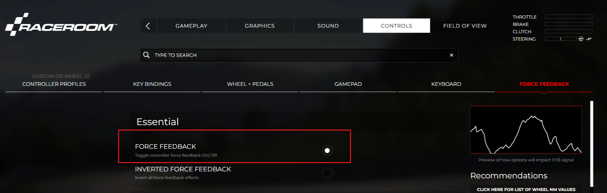
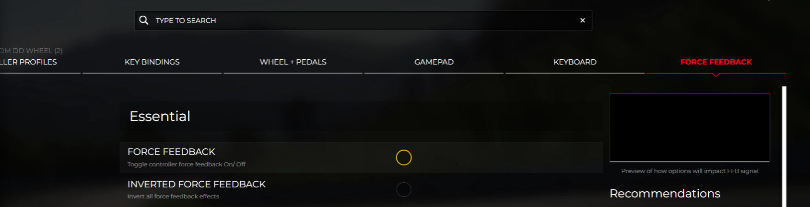

# R3E Custom FFB — Before you start

> Gerado por `tests/scripts/export-textos.mjs` a partir de `labels.json`.
> Instruções obrigatórias da 1.ª execução (FfbHub.NoticeVersion = 1).
> Não editar à mão: as alterações fazem-se no labels.json e volta-se a correr o script.

---

## English (official)

### Before you start

Before using this application you must turn Force Feedback OFF in RaceRoom, under Controls → Force Feedback, as shown in the images below. Only then is your device free for R3E Custom FFB to use: the application reads the data directly from the shared-memory telemetry, so there is no conflict between the two modes driving the same device.

Once you have made the change, confirm using the button below.

*✕ RaceRoom — Force Feedback ON (must be changed)*

*✓ RaceRoom — Force Feedback OFF (correct)*

---

## Português (oficial)

### Antes de começar

Antes de utilizar esta aplicação é fundamental desativar o Force Feedback do simulador RaceRoom, em Controls → Force Feedback, como mostrado nas imagens abaixo. Só desta forma o dispositivo fica livre para a aplicação R3E Custom FFB: a aplicação lê os dados diretamente da telemetria na área de memória partilhada, e assim não há conflito entre os dois modos a usar o mesmo dispositivo.

Depois de fazer o ajuste, confirme no botão abaixo.

*✕ RaceRoom — Force Feedback LIGADO (tem de ser alterado)*

*✓ RaceRoom — Force Feedback DESLIGADO (correto)*

---

Wondering what the application touches on your system? See
[What it touches](what-it-touches.md) — every file read or written, and why no
RaceRoom file is ever modified.
